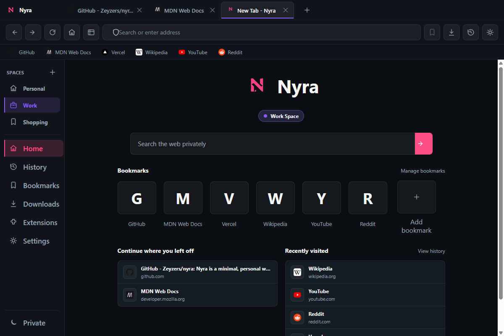
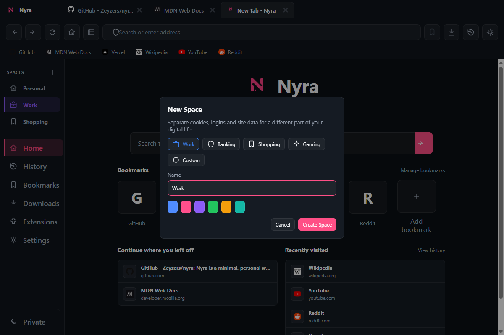
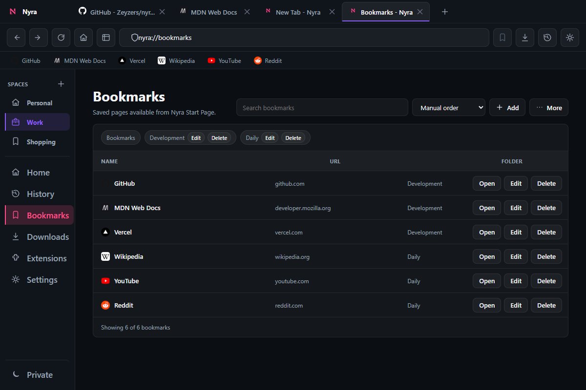
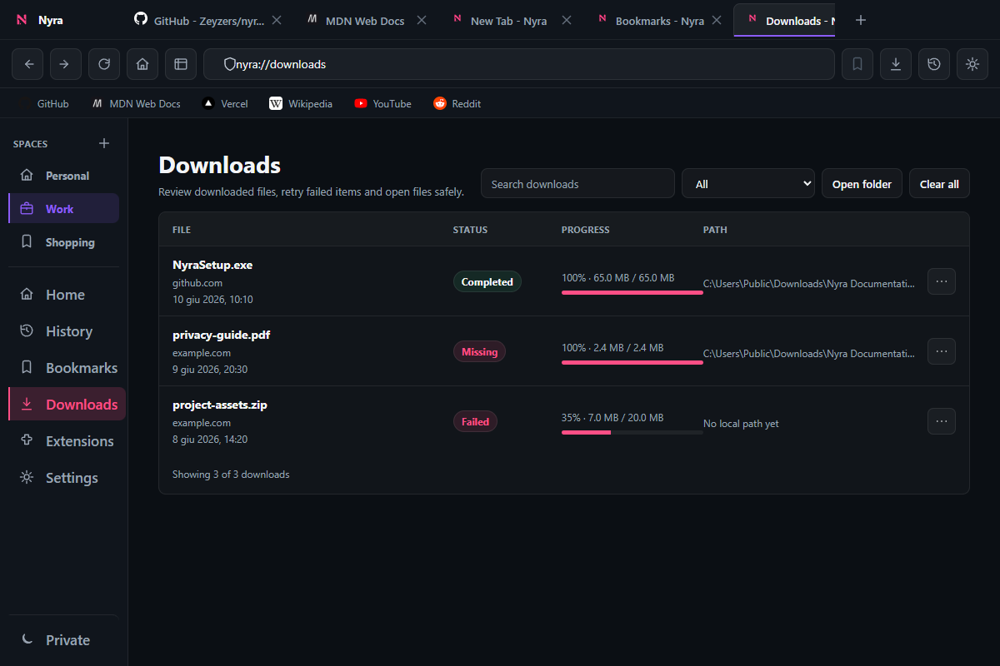
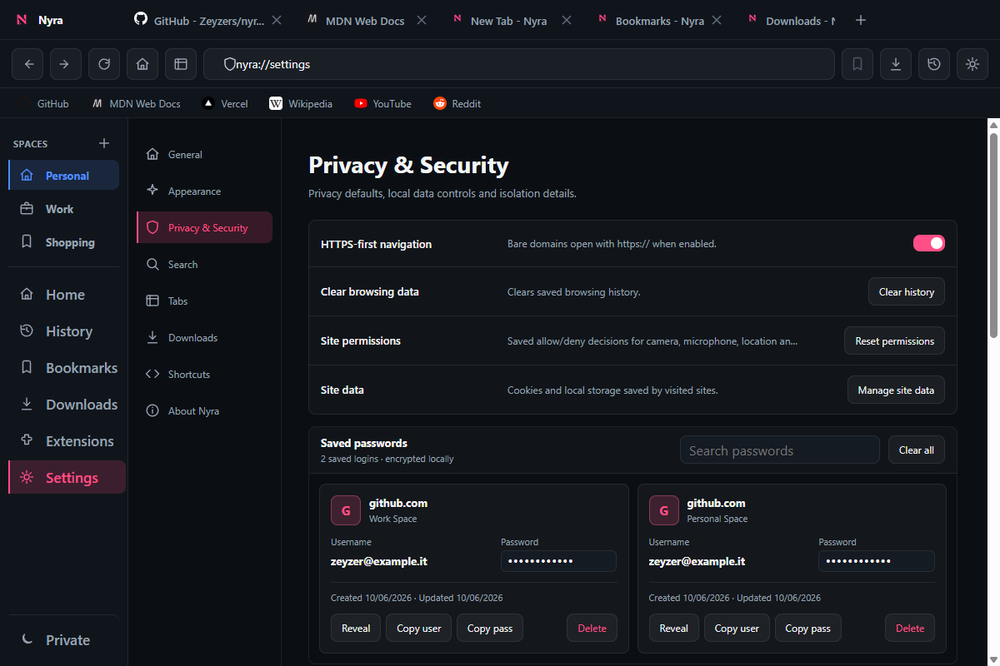

# Nyra（ナイラ）

> - This project is also available in **[English](../README.md)**.
> - Questo progetto è disponibile anche in **[Italiano](./README.it.md)**.
> - Dieses Projekt ist auch in **[Deutsch](./README.de.md)** verfügbar.

Nyraは、Electronで作られたミニマルでパーソナルなデスクトップブラウザです。

静かで速く、デフォルトでプライバシーを大切にしながら、タブ、ブックマーク、履歴、ダウンロード、設定、権限、保存済みパスワード、自動アップデートなど、日常的なブラウザ機能も備えることを目指しています。


---

## ステータス

現在のバージョン: **1.7.0**

Nyraは現在も開発中です。現時点ではWindowsが主なターゲットです。Linux向けのパッケージングスクリプトもありますが、機能とリリースはまずWindowsで検証されています。

最新リリース:

https://github.com/zeyzers/nyra/releases

---

## プロジェクトの状態

Nyraは個人開発のオープンソースブラウザプロジェクトです。利用はできますが、まだ実験的です。アップデートは自分の自由時間に行っています。

---

## Nyraを作った理由

Nyraは、デスクトップブラウザの仕組みを理解し、Electronを試し、自分らしく、シンプルで、改造しやすいブラウザを作るために始めました。

---

## スクリーンショット

以下は現在のWindows開発ビルドを実際に撮影したスクリーンショットです。

### ブラウザと新しいタブ

現在のSpaceのブックマーク、最近開いたサイト、復元できるページからすぐに始められます。



### Nyra Spaces

仕事、個人用ブラウジング、ショッピングなど、デジタルライフの用途ごとに分離されたSpaceを作成できます。



### ブックマーク

内蔵のブックマークマネージャーで、保存したサイトの整理、検索、編集、表示ができます。



### ダウンロード

永続化されたダウンロード、進行状況、見つからないファイル、ファイル操作を1つのページで確認できます。



### プライバシーとセキュリティ

HTTPS-Firstナビゲーション、ローカルで暗号化されたパスワード、サイトデータ、Spaceごとの権限を管理できます。



---

## 機能

### ブラウザシェル

- Nyraのアクセントカラーを持つ、ダークでフラットなモダンUI。
- 複数タブ、タブのクローズ、ドラッグ&ドロップ並び替え、ピン留め、複製、ミュート/解除。
- `Ctrl+Shift+T` で閉じたタブを再度開く。
- タブのメタデータを含むセッション復元。
- 永続設定つきのコンパクト/展開サイドバー。
- 戻る、進む、リロード/停止、ホーム、アドレスバー、ブックマーク、ダウンロード、履歴、設定を含むツールバー。
- よく使う操作のキーボードショートカット。
- アクティブなwebview用のドッキングDevTools。
- YouTubeなどのサイト向けFullscreen対応。
- 起動アニメーションとWindowsネイティブアイコン。
- 再起動後に適用されるハードウェアアクセラレーション設定。

### Spaces

- Cookie、ログイン、サイトデータを分離した複数のデジタル環境。
- 通常の各タブは、専用の永続Electron partitionを持つSpaceに所属。
- 名前、アイコン、色を設定したSpaceを作成。
- サイドバーからSpaceを切り替え、そのSpaceのタブだけを表示。
- Space間でタブを移動または複製。
- セッション復元時も各タブのSpaceを維持。
- パスワード、権限、サイトデータを正しいSpaceに関連付けて保存。

### 内部ページ

Nyraはブラウザ機能に内部ページを使います:

- `nyra://newtab` - プライベート検索とブックマークグリッドの開始ページ。
- `nyra://blank` - 空の新規タブ。
- `nyra://history` - 検索と削除ができるローカル履歴。
- `nyra://bookmarks` - ブックマークマネージャ。
- `nyra://downloads` - ダウンロードマネージャ。
- `nyra://settings` - 設定。
- `nyra://site-data` - CookieとLocal Storageの管理。
- `nyra://diagnostics` - 起動、キャッシュ、ブラウザ診断。
- `nyra://extensions` - unpacked拡張機能の管理。

### 検索とナビゲーション

- アドレスバーでURLと検索クエリに対応。
- 検索エンジン: DuckDuckGo、Google、Bing。
- プロトコルなしドメインのHTTPS-firstナビゲーション。
- サポート外の入力スキームを安全に処理。
- リトライ操作つきの内部エラーページ。
- PDFリンクは可能な場合Chromium/Electronで開きます。読み込みに失敗した場合は、retry、PDF download、外部で開く操作を表示します。

### ブックマーク

- ツールバーからブックマーク追加/削除。
- New Tabページのブックマークグリッド。
- `nyra://bookmarks` の完全なブックマーク管理。
- 編集、削除、検索、ソート。
- 1階層のブックマークフォルダ。
- ドラッグ&ドロップによる並び替え。
- ブラウザ形式HTMLのインポート/エクスポート。
- ブラウザシェル内のブックマークバー。

### ダウンロード

- ローカルに保存される永続的なダウンロード履歴。
- ツールバーのダウンロードドロップダウン。
- `nyra://downloads` の完全なダウンロード管理。
- 検索とステータスフィルタ。
- 状態: downloading、completed、failed、canceled、missing。
- 進捗、ファイルサイズ、origin、ローカルパス、日時表示。
- open file、show in folder、retry、remove、clear history。
- ダウンロード中はツールバーアイコンの周囲にライブ円形インジケータを表示。
- 完了したダウンロードは、ドロップダウンを開くまでアイコンがハイライトされます。
- ダウンロードフォルダと「保存先を確認」設定。

### パスワードマネージャ

- Electron `safeStorage` が利用可能な場合、ローカルで暗号化されたパスワード保存。
- originごとの複数アカウント。
- 保存/更新の明示的なプロンプト。
- ユーザー操作後にのみ認証情報を入力。
- 設定内で保存済みパスワードを管理。
- reveal、username copy、password copy、delete login、clear all。
- プライベートタブではパスワードを保存しません。

### プライバシーとセキュリティ

- リモートページは分離されたwebviewで実行されます。
- Nyra APIは信頼されたローカルページのみに公開されます。
- Node.jsはリモートページに公開されません。
- Webポップアップはデフォルトでブロックされます。
- デフォルトでは `mailto:` と `tel:` のみOSへ渡されます。
- サイト権限はNyraのプロンプトで処理され、ドメインごとに保存されます。
- 権限マネージャはcamera、microphone、geolocation、notificationsに対応。
- Site Data ManagerでCookie/Local Storageをドメインごと、または一括削除できます。
- プライベートタブは別のwebview partitionを使い、セッション、履歴、パスワード保存フローから除外されます。

### アップデートとパッケージング

- Windows installer: `NyraSetup.exe`。
- Windows portable build: `Nyra.exe`。
- GitHub Releasesで配布。
- パッケージ済みビルドは `electron-updater` による update check に対応。
- リリースメタデータには `latest.yml` とNSIS blockmapを含みます。
- Linux向けに `tar.gz`、`AppImage`、`deb` のスクリプトがありますが、現在の主な検証対象はWindowsです。

---

## はじめかた

### 必要なもの

- [Node.js](https://nodejs.org/)
- [Git](https://git-scm.com/)

### クローンと起動

```bash
git clone https://github.com/zeyzers/nyra.git
cd nyra
npm install
npm start
```

---

## 開発スクリプト

```bash
npm start
```

開発モードでNyraを起動します。

```bash
npm run lint
```

main、preload、renderer、helper、testの構文チェックを実行します。

```bash
npm test
```

ローカルテストスイートを実行します。

```bash
npm run dist
```

Windows installerとportable buildを作成します。

```bash
npm run dist:linux
```

Linux `tar.gz` パッケージを作成します。

```bash
npm run dist:linux:full
```

Linux `AppImage`、`deb`、`tar.gz` を作成します。

---

## リリースワークフロー

Nyraは配布とupdater metadataにGitHub Releasesを使います。

通常の流れ:

1. feature/fixを完成させてcommitする。
2. 実際にreleaseを準備するときだけversion bumpする。
3. `npm run lint` を実行。
4. `npm test` を実行。
5. `npm run dist` を実行。
6. version bumpをcommit。
7. `v1.7.0` のようなtagを作成。
8. GitHub Releaseを作成してアップロード:
   - `NyraSetup.exe`
   - `NyraSetup.exe.blockmap`
   - `latest.yml`
   - 必要なら `Nyra.exe`

実用的なsemantic versioning:

- Patch: bugfix、polish、小さく安全なfeature。
- Minor: 大きめのユーザー向けfeature pack。
- Major: breaking change、または大きなarchitecture/data変更。

---

## ストレージ

NyraはElectronの `userData` ディレクトリにブラウザ状態を保存します。

メインの状態ファイル:

- `nyra-state.json`

設定、セッションタブ、ブックマーク、ダウンロード、権限、履歴、拡張機能メタデータなどのローカル状態を含みます。

パスワードは別ファイルに保存されます:

- `passwords.json`

OS暗号化が利用可能な場合、パスワードはElectron `safeStorage` で暗号化されます。破損したstate/passwordファイルは、クリーンな初期状態を作る前にバックアップされます。

---

## プライバシーノート

Nyraはlocal-firstです:

- アカウントシステムなし。
- クラウド同期なし。
- このrepositoryにはtelemetry実装なし。
- パスワードサーバーなし。
- WebサイトからのリモートNodeアクセスなし。

ただし、Cookie、Local Storage、ダウンロード履歴、保存済みパスワード、閲覧履歴などの通常のブラウザデータは、使い方や設定によってローカルに保存されます。

---

## ロードマップ

今後改善したい主な領域:

- ブックマークバーのより完全な操作。
- より完全な拡張機能サポート。
- Reader mode。
- Task Manager/プロセス情報のような高度な診断。
- Nyraユーザーデータ全体のより良いimport/export。
- Private modeのさらなるpolishとaudit。
- Electron/ChromiumのネイティブPDF動作が不安定な場合のより強いPDF handling。

---

## コントリビュート

貢献は歓迎です。

1. リポジトリをforkします。
2. branchを作成します。
3. 変更をcommitします。
4. branchをpushします。
5. pull requestを作成します。

変更はできるだけ焦点を絞り、関係のないfeatureを1つのPRに混ぜないでください。

---

## ライセンス

このプロジェクトはMITライセンスで公開されています。

---

## 作者

[@zeyzers](https://github.com/zeyzers) によって好奇心で作られました。
